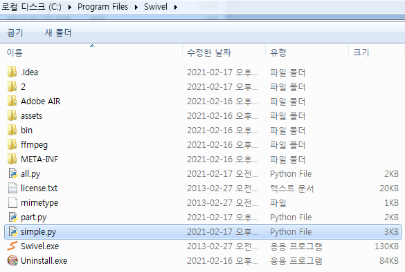
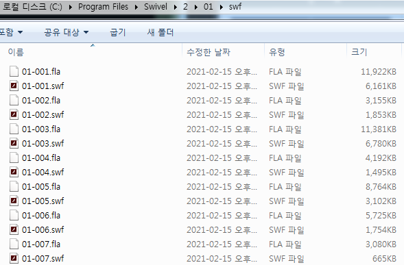
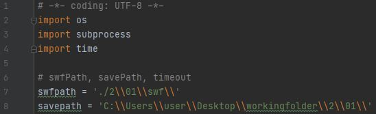
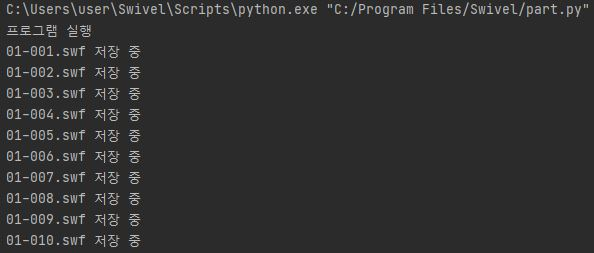
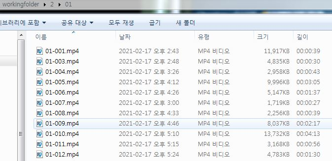
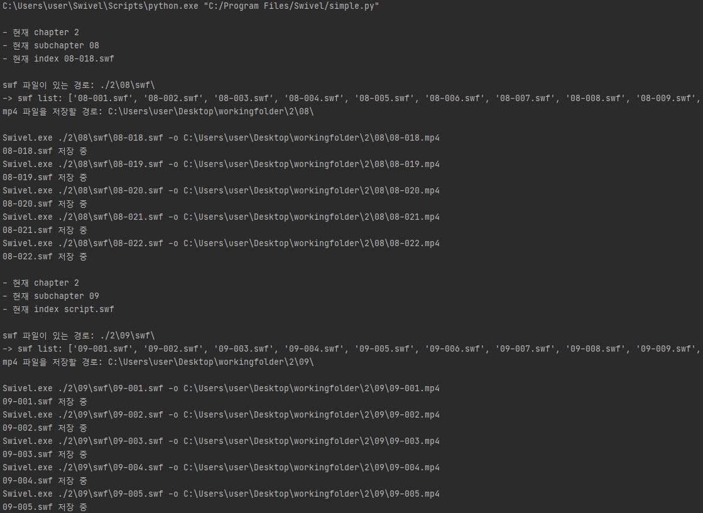
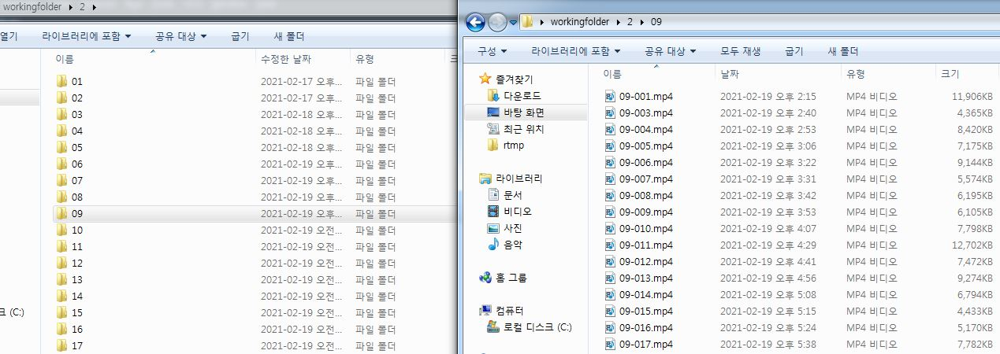

https://www.davepagurek.com/blog/using-swivel-in-batch-from-the-terminal/ 참고

# simple
1. python file을 Swivel 경로에 넣기

2. swf 파일 경로/저장 경로 설정 

3. 프로그램 실행 시, mp4 파일로 자동 변환

# chapter

1. python file을 Swivel 경로에 넣기

2. 마찬가지로 chapter, subchapter, subchapter_index 값 넣고, swf 파일 경로/저장 경로 설정 

3. 프로그램 실행 시, mp4 파일로 자동 변환되고

5. chapter가 끝나면 다음 chapter로 넘어감

일일히 안해도됌ㅁㅁㅁㅁㅁㅁㅁㅁㅁ 뚞딲뚞딲

귀찮아ㅅㅓ 만들어봄! 영상도 짤ㄴㅏ온당 ㅎ.ㅎ 

(근데 보안문제  특정 컴터에서만 사용하라하셔가꼬 그렇게했따)

오랜만에 파이썬하니 넘 재밌었ㄸ ㅏ 역시 파이썬!짱!
